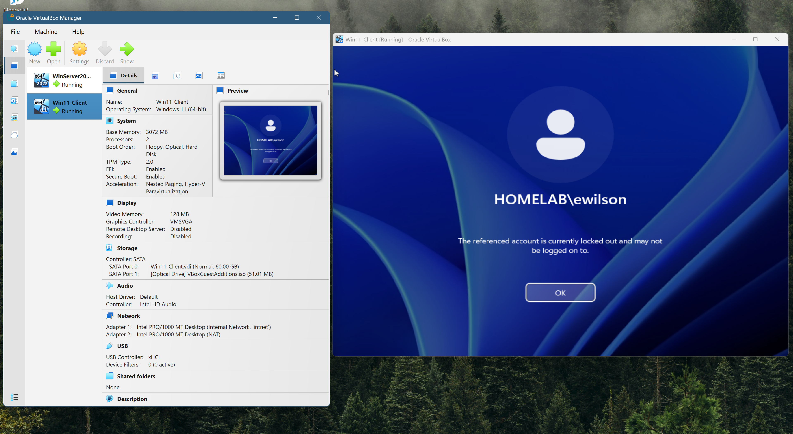

# Account Lockout Diagnosis and Reset

**Tier 2: Client Troubleshooting and Remote Support**
**Environment:** homelab.local domain, Windows Server 2022 Server Core domain controller (DC01), Windows 11 domain-joined client
**Tools used:** Active Directory Users and Computers (ADUC), PowerShell (Active Directory module)

This writeup is framed as a help-desk ticket because that is how the work actually arrives in a support role. An account lockout is one of the most common tickets a first-line technician handles, so I wanted to document not just the fix but the reasoning that gets you to it, including how you tell a lockout apart from a forgotten password.

---

## The ticket

**Reference:** HD-0142
**Reported by:** Emma Wilson (HR department)
**Priority:** Medium
**Summary:** "I can't log in. I know my password is right but it won't let me in."

Emma reports that she is certain her password is correct, but she cannot sign in to her workstation. She has not changed her password recently and nothing has changed on her side that she is aware of.

---

## Step 1: Establish what kind of problem this actually is

The first thing I wanted to do was separate the three things that all feel the same to a user but have completely different fixes:

1. **Forgotten password** - the user genuinely has the wrong password. Fix is a password reset.
2. **Account locked out** - the password may well be correct, but the account is locked because of too many failed attempts. Fix is an unlock, not a reset.
3. **Account disabled or expired** - the account has been switched off or has passed its expiry date. Fix is to re-enable or extend it.

Emma insisting her password is correct is a useful clue, but it is not proof on its own, plenty of lockout tickets turn out to be a stale password cached on a phone or a mapped drive. So rather than take her word for it or immediately reset her password, I checked the account state directly.

The giveaway at the login screen is the wording. A wrong password gives a generic "the user name or password is incorrect" message. A locked account gives a specific one:

> The referenced account is currently locked out and may not be logged on to.

That message is the strongest signal that this is a lockout and not a forgotten password, because Windows only shows it once the lockout threshold has been crossed.



---

## Step 2: Confirm the lockout from the domain controller

A login-screen message is a strong hint, but I wanted to confirm it against the source of truth, the domain controller, rather than rely on what the workstation was showing. From the Windows 11 client I used the Active Directory PowerShell module (the client has RSAT installed, so it queries DC01 remotely):

```powershell
Get-ADUser ewilson -Properties LockedOut | Select-Object Name,LockedOut
```

This returned:

```
Name           LockedOut
----           ---------
Emma Wilson    True
```


`LockedOut : True` confirms it. This is a genuine lockout, not a forgotten password. Resetting her password would not have fixed it, and would have created a second problem by changing a password she did not need changed.

For a quicker check that just returns the value on its own, this does the same job:

```powershell
(Get-ADUser ewilson -Properties LockedOut).LockedOut
```

---

## Step 3: Understand why it locked

Before fixing it, it is worth knowing what governs lockouts on this domain, because the policy is what decides when an account locks and when it frees itself again. I checked the live policy with:

```powershell
Get-ADDefaultDomainPasswordPolicy
```

The relevant values on homelab.local are:

| Setting | Value | What it means |
|---|---|---|
| LockoutThreshold | 5 | The account locks after 5 failed sign-in attempts |
| LockoutDuration | 00:10:00 | Once locked, it stays locked for 10 minutes |
| LockoutObservationWindow | 00:10:00 | Failed attempts are counted within a rolling 10-minute window |

There is an important subtlety here that took me a while to appreciate properly when I was testing this. The failed-attempt counter is not a lifetime total. It only counts failures **within the observation window**, and crucially, **a single successful login resets the counter back to zero**. So five failures spread out with a successful login in between will never trigger a lockout. It takes five failures in a row, inside the window, with no success between them. This is exactly why real lockouts can be confusing to reproduce and diagnose, and why a user can sometimes "fix it themselves" without realising, they simply got the password right before hitting the limit.

In a real environment the usual culprits for unexpected lockouts are:

- A phone or tablet still configured with the user's old password, retrying email in the background.
- A mapped network drive or saved credential using a stale password.
- A scheduled task or service running under the user's account with an outdated password.
- Something as simple as Caps Lock or a stuck key.

Knowing this shapes the advice I would give Emma after unlocking her, so the same ticket does not come straight back.

---

## Step 4: Resolve the lockout (ADUC method)

The graphical route through Active Directory Users and Computers is the one most first-line technicians reach for, and it is the clearest to show.

1. Open **Active Directory Users and Computers** on the client.
2. Expand **homelab.local** and select the **HR** organisational unit.
3. Right-click **Emma Wilson** and choose **Properties**.
4. Go to the **Account** tab.
5. The tick box reads **"Unlock account. This account is currently locked out on this Active Directory Domain Controller."** The presence of that line is itself confirmation that the account is locked, a healthy account does not show it as actionable.
6. Tick **Unlock account**, then click **Apply** and **OK**.


That immediately clears the lockout. The account is not changed in any other way, the password stays exactly as it was, which is the whole point of unlocking rather than resetting.

---

## Step 5: Resolve the lockout (PowerShell equivalent)

The same fix from the command line is a single cmdlet, and it is worth knowing because it scales. If you ever need to unlock several accounts at once, or unlock someone without clicking through the GUI, this is faster:

```powershell
Unlock-ADAccount -Identity ewilson
```

There is no output on success, which is normal for this cmdlet. You confirm it worked by re-checking the state rather than expecting a message.

It is also worth noting a third path that needs no action at all: because **LockoutDuration is 10 minutes**, a locked account will **automatically unlock itself after 10 minutes** even if nobody touches it. For a user who can wait, that is sometimes the simplest answer. For a user who needs to get back to work immediately, the manual unlock above is the right call.

---

## Step 6: Verify the resolution

I never close a ticket on the assumption that the fix worked. After unlocking Emma's account I re-ran the same check I used to diagnose it:

```powershell
(Get-ADUser ewilson -Properties LockedOut).LockedOut
```

This returned:

```
False
```

`LockedOut : False` confirms the account is now healthy. I would then confirm with Emma that she can sign in normally before closing the ticket.


---

## Step 7: Prevent the repeat

A good ticket resolution includes stopping it happening again. Before closing HD-0142 I would talk Emma through the likely causes and check the obvious ones:

- Ask whether she has email set up on a phone or tablet, and if so, update the password there so it stops retrying with an old one.
- Check for any mapped drives or saved Windows credentials holding a stale password.
- Confirm Caps Lock was not the original culprit.

If the same account keeps locking with no obvious user-side cause, the next step would be to trace **which machine** the bad attempts are coming from, the domain controller's security event log records the source, so a persistent phantom lockout can be tracked back to the specific device that is hammering the account.

---

## Resolution summary

| Field | Detail |
|---|---|
| Root cause | Account locked after exceeding the 5-attempt threshold within the 10-minute window |
| Misdiagnosis avoided | Treated as a lockout, not a forgotten password, so no unnecessary password reset |
| Fix applied | Account unlocked via ADUC (Account tab), PowerShell equivalent `Unlock-ADAccount` documented |
| Verified | `LockedOut` confirmed `False` after the fix |
| Follow-up | User advised on stale cached credentials to prevent recurrence |

---

## What this demonstrates

- Telling a lockout apart from a forgotten password before touching anything, and why that distinction matters.
- Confirming account state against the domain controller rather than trusting the symptom.
- Reading and understanding the domain lockout policy, including the observation window and counter-reset behaviour.
- Resolving the issue through both the graphical console and PowerShell.
- Verifying the fix and giving preventative advice, rather than just clearing the immediate symptom.
